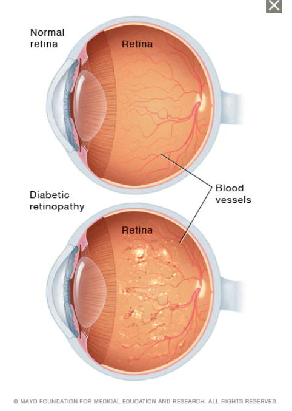
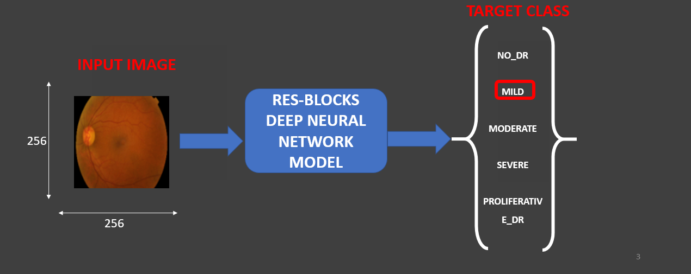
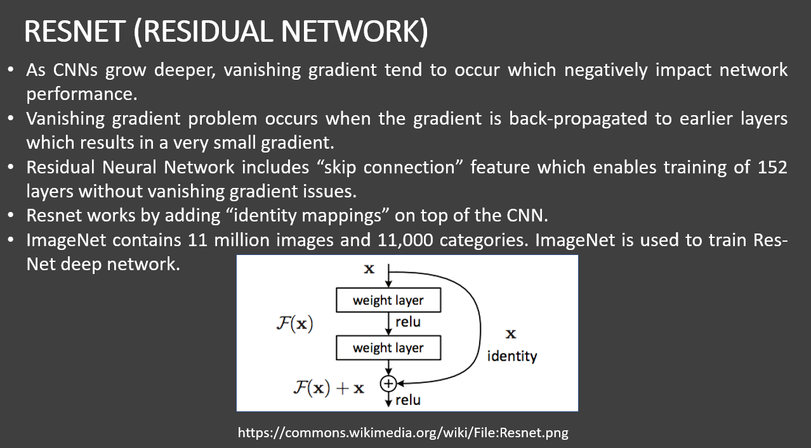
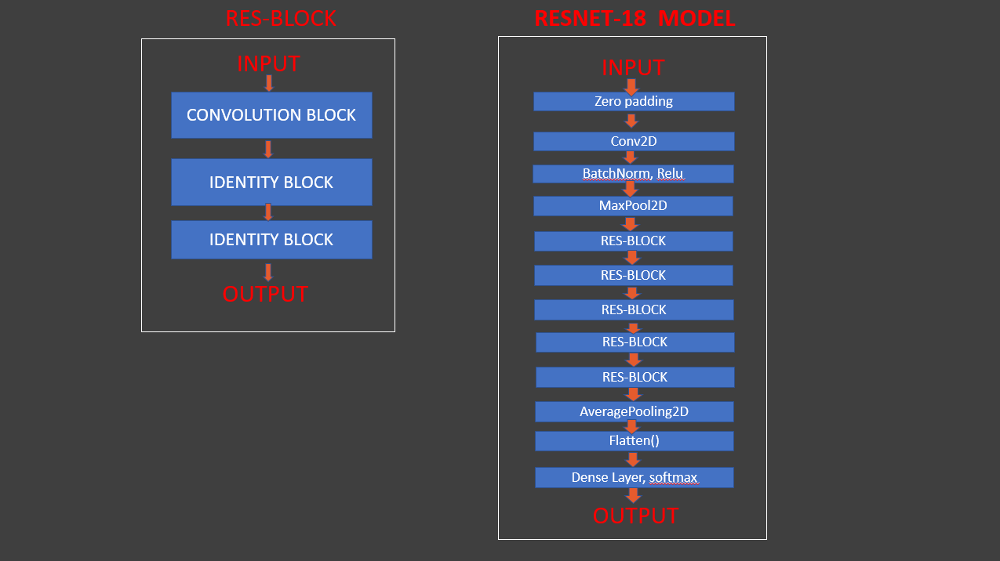
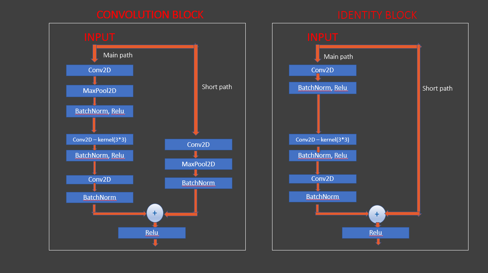
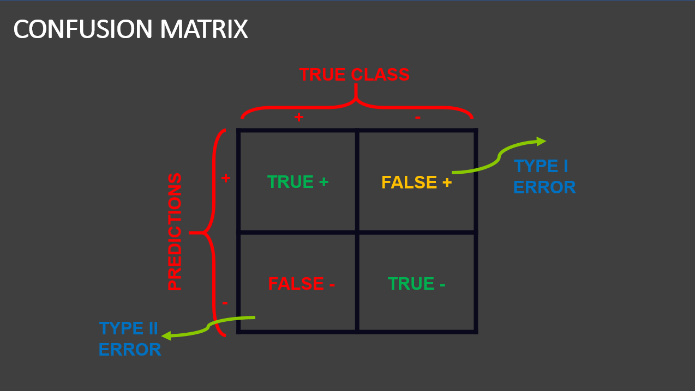

# Diabetic Retinopathy 

`Diabetic retinopathy` is a diabetes complication that affects eyes. It's caused by damage to the blood vessels of the light-sensitive tissue at the back of the eye (retina).

At first, diabetic retinopathy might cause no symptoms or only mild vision problems. But it can lead to blindness. The condition can develop in anyone who has `type 1` or `type 2` diabetes. The longer you have diabetes and the less controlled your blood sugar is, the more likely you are to develop this eye complication.

# Causes

Over time, too much sugar in your blood can lead to the blockage of the tiny blood vessels that nourish the retina, cutting off its blood supply. As a result, the eye attempts to grow new blood vessels. But these new blood vessels don't develop properly and can leak easily.

**There are two types of diabetic retinopathy**

`Early diabetic retinopathy`:  In this more common form — called nonproliferative diabetic retinopathy (NPDR) — new blood vessels aren't growing (proliferating).
When you have NPDR, the walls of the blood vessels in your retina weaken. Tiny bulges protrude from the walls of the smaller vessels, sometimes leaking fluid and blood into the retina. Larger retinal vessels can begin to dilate and become irregular in diameter as well. NPDR can progress from mild to severe as more blood vessels become blocked.

Sometimes retinal blood vessel damage leads to a buildup of fluid (edema) in the center portion (macula) of the retina. If macular edema decreases vision, treatment is required to prevent permanent vision loss.

`Advanced diabetic retinopathy`: Diabetic retinopathy can progress to this more severe type, known as proliferative diabetic retinopathy. In this type, damaged blood vessels close off, causing the growth of new, abnormal blood vessels in the retina. These new blood vessels are fragile and can leak into the clear, jellylike substance that fills the center of your eye (vitreous).

Eventually, scar tissue from the growth of new blood vessels can cause the retina to detach from the back of your eye. If the new blood vessels interfere with the normal flow of fluid out of the eye, pressure can build in the eyeball. This buildup can damage the nerve that carries images from your eye to your brain (optic nerve), resulting in glaucoma.

# Objective

The goal of the project is to develop a Deep Neural Network Model which can predict the stage of diabetic retinopathy of an individual with minimal professional doctor input.

1. Import a dataset categorized in 5 different stages of Diabetic Retinopathy.
2. Classify the dataset into training and testing data.
3. Build a Deep Neural Network Model using CNN and RESNET and train it with the training data.
4. Test the model accuracy against the testing data and check the output result.

# Data

1) The dataset consists of 200 images belonging to 5 classes
2) Categories that are present in the dataset are N0_DR, Mild, Moderate, Severe, Proliferative_DR

# Convolutional Neural Network(CNN)

A `Convolutional Neural Network (ConvNet/CNN)` is a Deep Learning algorithm which can take in an input image, assign importance (learnable weights and biases) to various aspects/objects in the image and be able to differentiate one from the other. While in primitive methods filters are hand-engineered, with enough training, ConvNets have the ability to learn these filters/characteristics.

The architecture of a ConvNet is analogous to that of the connectivity pattern of Neurons in the Human Brain and was inspired by the organization of the Visual Cortex. Individual neurons respond to stimuli only in a restricted region of the visual field known as the Receptive Field. A collection of such fields overlap to cover the entire visual area.

Learn more at: https://en.wikipedia.org/wiki/Convolutional_neural_network

# Residual Neural Network(RESNET)

`Residual Network (ResNet)` is one of the famous deep learning models that was introduced by Shaoqing Ren, Kaiming He, Jian Sun, and Xiangyu Zhang in their paper. The paper was named “Deep Residual Learning for Image Recognition” [1] in 2015. The ResNet model is one of the popular and most successful deep learning models so far.

Learn more at: https://www.analyticsvidhya.com/blog/2021/06/build-resnet-from-scratch-with-python/

# Confusion Matrix

A confusion matrix is a table that is often used to describe the performance of a classification model (or "classifier") on a set of test data for which the true values are known. The confusion matrix itself is relatively simple to understand, but the related terminology can be confusing.

Learn more at: https://www.dataschool.io/simple-guide-to-confusion-matrix-terminology/

# NOTE

1. To increase the accuracy of the model, a large dataset is recommended. Here I have used only 200 images, the more data the better the accuracy is.
2. Try to keep the batch size small while building the generator(line number 10), like 5, 10 or 20. This will help a little to improve the accuracy.
3. If you are keep your batch size 5 then make sure to replace all places with 5, where you see // (in line number 76 and 79).
4. To improve the accuracy, try for different combinations of epoch and patience. Keep training the data and you will get a better accuracy.

# References

1) https://www.coursera.org/learn/retinopathy-detection-using-deep-learning/home/welcome
2) https://www.mayoclinic.org/diseases-conditions/diabetic-retinopathy/symptoms-causes/syc-20371611
3) https://towardsdatascience.com/a-comprehensive-guide-to-convolutional-neural-networks-the-eli5-way-3bd2b1164a53
4) https://en.wikipedia.org/wiki/Convolutional_neural_network
5) https://www.analyticsvidhya.com/blog/2021/06/build-resnet-from-scratch-with-python/
6) https://www.dataschool.io/simple-guide-to-confusion-matrix-terminology/